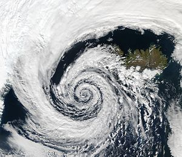
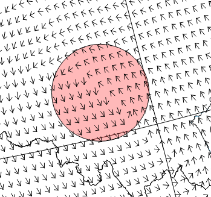
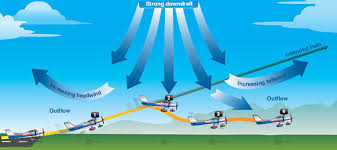
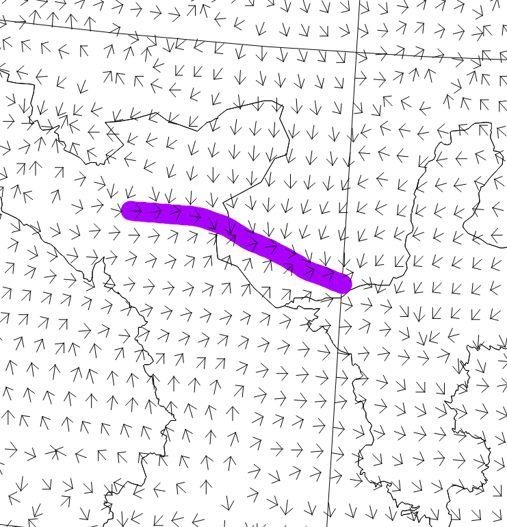
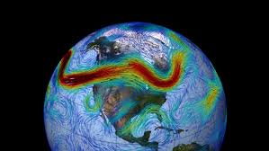
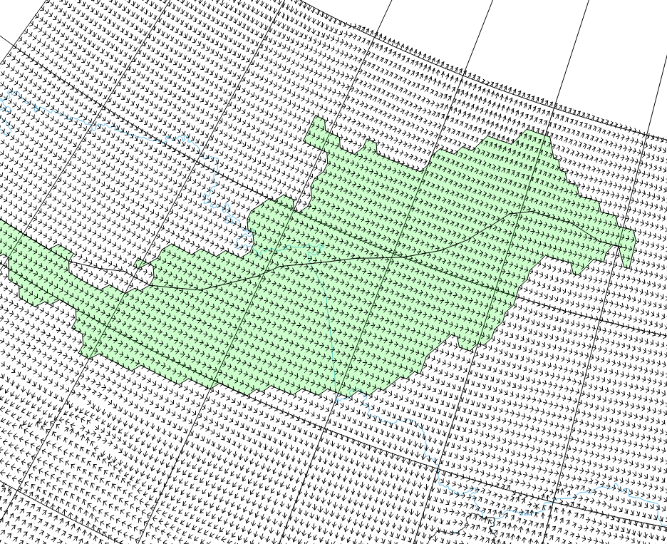
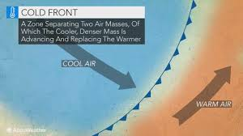
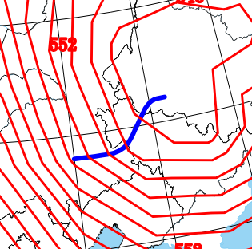
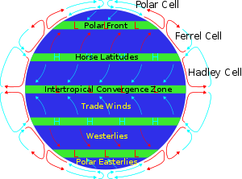
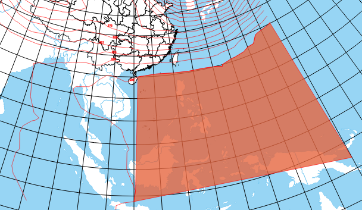

# Weather system identification software

This project is used to extract weather-systems from the output Numerical Weather Prediction and visualize them. Developer Erichen, affiliated to Pattern, Tianjin University Recognition Laboratory. As part of the research content is in the paper submission stage, only part of the code is open to the public. If you need to exchange the complete code, please contact me by e-mail.

## Software introduction
The main view of the Visualization software.

* **Input**: The Netcdf file of the numerical weather prediction data. **EDA**, **VV** and **HGT** must be included in the keys of the file.
* **Pressures**: 500hPa,750hPa,850hPa,950hPa
* **Map projection**: Mercator projection, Equal Earth projection, Lambert cylindrical projection

---

## Extractable
* cyclone 
* wind shear
* jet stream
* cold front
* warm ridge
* subtropical high
---

## Cyclone
In meteorology, a cyclone is a large scale air mass that rotates around a strong center of low atmospheric pressure. Cyclones are characterized by inward spiraling winds that rotate about a zone of low pressure. The largest low-pressure systems are polar vortices and extratropical cyclones of the largest scale (the synoptic scale). Warm-core cyclones such as tropical cyclones and subtropical cyclones also lie within the synoptic scale. Mesocyclones, tornadoes, and dust devils lie within smaller mesoscale. Upper level cyclones can exist without the presence of a surface low, and can pinch off from the base of the tropical upper tropospheric trough during the summer months in the Northern Hemisphere. 

---

## Wind Shear
Wind shear (or windshear), sometimes referred to as wind gradient, is a difference in wind speed or direction over a relatively short distance in the atmosphere. Atmospheric wind shear is normally described as either vertical or horizontal wind shear. Vertical wind shear is a change in wind speed or direction with change in altitude. Horizontal wind shear is a change in wind speed with change in lateral position for a given altitude.

Wind shear is a microscale meteorological phenomenon occurring over a very small distance, but it can be associated with mesoscale or synoptic scale weather features such as squall lines and cold fronts. It is commonly observed near microbursts and downbursts caused by thunderstorms, fronts, areas of locally higher low-level winds referred to as low level jets, near mountains, radiation inversions that occur due to clear skies and calm winds, buildings, wind turbines, and sailboats. Wind shear has significant effects on control of an aircraft, and it has been a sole or contributing cause of many aircraft accidents.

---

## Jet stream
Jet streams are fast flowing, narrow, meandering air currents in the atmospheres of some planets, including Earth. On Earth, the main jet streams are located near the altitude of the tropopause and are westerly winds (flowing west to east). Their paths typically have a meandering shape. Jet streams may start, stop, split into two or more parts, combine into one stream, or flow in various directions including opposite to the direction of the remainder of the jet.

---

## Cold Front
A cold front is the leading edge of a cooler mass of air, replacing at ground level a warmer mass of air, which lies within a fairly sharp surface trough of low pressure. It forms in the wake of an extratropical cyclone, at the leading edge of its cold air advection pattern, which is also known as the cyclone's dry conveyor belt circulation. Temperature differences across the boundary can exceed 30 °C (54 °F) from one side to the other. When enough moisture is present, rain can occur along the boundary. If there is significant instability along the boundary, a narrow line of thunderstorms can form along the frontal zone. If instability is less, a broad shield of rain can move in behind the front, which increases the temperature difference across the boundary. Cold fronts are stronger in the fall and spring transition seasons and weakest during the summer.

---

## Subtropical high
Horse latitudes, subtropical ridges or subtropical highs are the subtropical latitudes between 30 and 35 degrees both north and south where Earth's atmosphere is dominated by the subtropical high, an area of high pressure, which suppresses precipitation and cloud formation, and has variable winds mixed with calm winds.

---

## Warm Ridge
Still working on it
